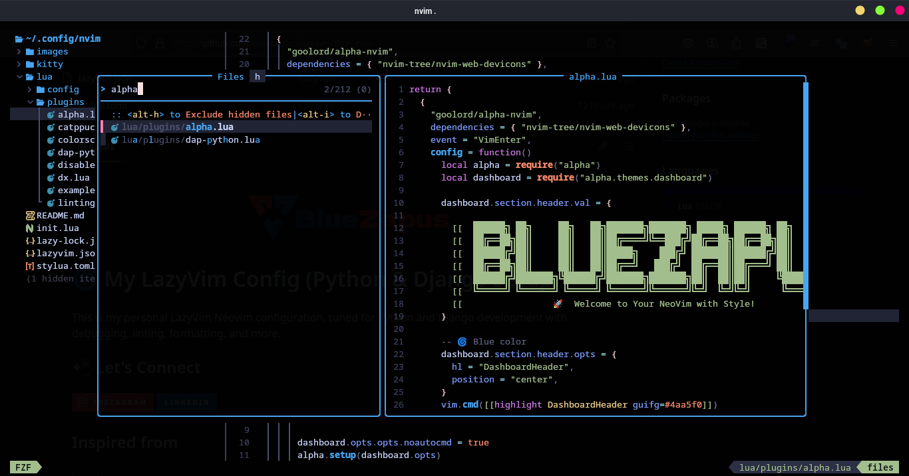

# My LazyVim Config (Python & Django Setup)

This is my personal LazyVim Neovim configuration, tuned for Python and Django development with debugging, linting, formatting, and more.
## 📲 Let's Connect

[](https://www.instagram.com/fl0.w3r3w.0lf/)
[](https://www.linkedin.com/in/randy-dwi-prastyo-8bb0082a9/)


## Inspired from

#### Lazyvim

https://www.lazyvim.org/

https://github.com/deaafrizal/lazyvim.git



- [Features](#-features)
- [Quick Setup](#-quick-setup)
- [Installation for MacOS](#-installation-for-mac-boygirl)
- [Installation for Ubuntu](#-installation-for-ubuntu)
- [Installation for Arch](#-installation-for-arch-btw)
- [Installation Dependencies](#installation-dependencies)
- [Installation LazyVim](#installation-lazyvim)
- [Django Framework Setup](#for-django-framework)
- [Neovim Tools via Mason](#-neovim-tools-via-mason)
- [KeyMaps](#key-map)
## Features


- 🐍 Python and Django support

- 🔛 Debugging with `nvim-dap-python`

- 🧹 Linting and formatting via `conform.nvim`

- 🗼️ Beautiful UI with [Catppuccin](https://github.com/catppuccin) theme

- ⚡ Fast and lazy-loaded plugins

- 💻 NerdFont and [Kitty](https://sw.kovidgoyal.net/kitty/) terminal ready


## Quick Setup
#### recommended using [Oh My Zsh](https://ohmyz.sh/) [Power Lavel 10k](https://github.com/romkatv/powerlevel10k?tab=readme-ov-file#oh-my-zsh) for a better appearance

```bash
  sh -c "$(curl -fsSL https://raw.githubusercontent.com/ohmyzsh/ohmyzsh/master/tools/install.sh)"
```
```bash
  chsh -s /bin/zsh
```
```bash
  git clone --depth=1 https://github.com/romkatv/powerlevel10k.git "${ZSH_CUSTOM:-$HOME/.oh-my-zsh/custom}/themes/powerlevel10k"
```
```bash
  nano ~/.zshrc
```
Open `~/.zshrc`, find the line that sets `ZSH_THEME`, and change its value to `"powerlevel10k/powerlevel10k"`.

```bash
  source .zshrc
```
```bash
  chsh -s /bin/zsh
```

- #### Installation for Mac Boy/Girl
Minimum Brew version 4.4.0
```bash
  brew --version
```
```bash
  /bin/bash -c "$(curl -fsSL https://raw.githubusercontent.com/Homebrew/install/HEAD/install.sh)"
```

```bash
  brew install --cask kitty
```
```bash
  brew install neovim lazygit fd ripgrep fzf python node git curl 
```
```bash
  brew tap homebrew/cask-fonts
brew install --cask font-fira-code-nerd-font
```

- #### Installation for Ubuntu
```bash
  python3 --version
```
```bash
  sudo apt install python3-venv zip unzip kitty neovim nodejs npm git curl xsel xclip ripgrep fzf
```
```bash
  mkdir -p ~/.local/share/fonts
  cd ~/.local/share/fonts
  wget https://github.com/ryanoasis/nerd-fonts/releases/latest/download/FiraCode.zip
  unzip FiraCode.zip
  rm FiraCode.zip
```
```bash
  fc-cache -fv
```
- #### Installation for Arch BTW

```bash
  python --version
```
```bash
  sudo pacman -S kitty neovim python-pip nodejs npm git curl ripgrep fd fzf
```
```bash
  yay -S ttf-firacode-nerd
```

### Installation Dependencies
```bash
  sudo npm install -g pyright prettier
```
```bash
  mkdir -p ~/.virtualenvs
```
```bash
  python3 -m venv ~/.virtualenvs/debugpy
```
```bash
  source ~/.virtualenvs/debugpy/bin/activate
```
```bash
  pip install debugpy setuptools
```
### Installation LazyVim
```bash
  git clone https://github.com/bluezapus/lazyvim.git ~/.config/nvim/
```
```bash
  cd ~/.config/nvim 
```
```bash
  mv kitty/ ~/.config/  
```
```bash
  nvim 
```
```bash
  :Lazy sync
```

#### If you're using `.virtualenvs` in project folders, `nvim-dap-python` will auto-detect it.
### for django framework

```bash
  pip install pynvim flake8 django djangorestframework black isort ruff djlint
```
```bash
  pip install --upgrade pip
```
```bash
  nvim
```
```bash
  : Lazy sync
```

### Neovim Tools via Mason
Open nvim and run:
```bash
  : Mason
```
#### install the following:
- `pyright` (Python LSP)
- `ruff-lsp` (optional for linting)
- `djlint` {for Django templates, via pip}

Use `:ConformInfo` or `:LspInfo` to see formatters and LSPs working.

<span style="color:red">Teks ini merah</span>
## Key Map

#### Plugin: `conform.nvim`

| Mode | Shortcut     | Function                |
| :-------- | :------- | :------------------------- |
| `n/v` | `<leader> cF` | Format file |

#### Plugin: `fzf-lua`


| Mode | Shortcut     | Function                |
| :-------- | :------- | :------------------------- |
| `n` | `<leader> sC` | Search |
| `n` | `<leader> sd` | Search diagnostics |
| `n` | `<leader> sD` | Search definitions |
| `n` | `<leader> sg` | Search grep |
| `n` | `<leader> sG` | Search live grep |
| `n` | `<leader> sh` | Search help |
| `n` | `<leader> sH` | Search highlight |
| `n` | `<leader>sj` | Jump search |
| `n` | `<leader>sk` | Keymap search |
| `n` | `<leader>sl` | Search lines |
| `n` | `<leader>sM` | Man pages |
| `n` | `<leader>sm` | Marks |
| `n` | `<leader>sR` | Registers |
| `n` | `<leader>sq` | Quickfix |
| `n` | `<leader>sw` | Search word |
| `n` | `<leader>sW` | Search WORD |
| `n` | `<leader>uC` | Color scheme preview |
| `n` | `<leader>ss` | Symbols |
| `n` | `<leader>sS` | Snippets |
| `n` | `<leader><space>` | Find files |
| `t` | `<C-j>` | Terminal down |
| `t` | `<C-k>` | Terminal up |
| `n` | `<leader>,` | Switch buffer |
| `n` | `<leader>/` | Search |
| `n` | `<leader>:` | Command palette |
| `n` | `<leader>fb` | Find buffers |
| `n` | `<leader>fc` | Find commands |
| `n` | `<leader>ff` | Find files |
| `n` | `<leader>fF` | Find recent files |
| `n` | `<leader>fg` | Find git files |
| `n` | `<leader>fr` | Find registers |
| `n` | `<leader>fR` | Find resume |
| `n` | `<leader>gc` | Git commits |
| `n` | `<leader>gs` | Git status |
| `n` | `<leader>s"` | Search open buffers |
| `n` | `<leader>sa` | Search autocommands |
| `n` | `<leader>sb` | Search buffers |
| `n` | `<leader>sc` | Search commands |


#### Plugin: grug-far.nvim
| Mode | Shortcut     | Function                |
| :-------- | :------- | :------------------------- |
| `n/v` | `<leader>sr` | Replace string |

#### Plugin: `neo-tree.nvim`

| Mode | Shortcut     | Function                |
| :-------- | :------- | :------------------------- |
| `n` | `<leader>ge` | Git explorer |
| `n` | `<leader>be` | Buffer explorer |
| `n` | `<leader>fe` | File explorer |
| `n` | `<leader>fE` | File explorer (root) |
| `n` | `<leader>e` | Explorer toggle |
| `n` | `<leader>E` | Explorer toggle |

#### Plugin: `nvim-dap`
| Mode | Shortcut     | Function                |
| :-------- | :------- | :------------------------- |
| `n` | `<leader>dk` | Up frame |
| `n` | `<leader>dl` | Down frame |
| `n` | `<leader>do` | Step over |
| `n` | `<leader>dO` | Step out |
| `n` | `<leader>dP` | Pause |
| `n` | `<leader>dr` | Restart |
| `n` | `<leader>ds` | Step into |
| `n` | `<leader>dt` | Toggle breakpoint |
| `n` | `<leader>dw` | Widgets |
| `n` | `<leader>dB` | Set conditional breakpoint |
| `n` | `<leader>db` | Toggle breakpoint |
| `n` | `<leader>dc` | Continue |
| `n` | `<leader>da` | Run to cursor |
| `n` | `<leader>dg` | Get session |
| `n` | `<leader>di` | Inspect |
| `n` | `<leader>dj` | Jump to source |

#### Plugin: `nvim-dap-python`
| Mode | Shortcut     | Function                |
| :-------- | :------- | :------------------------- |
| `n` | `<leader>dPt` | Test method |
| `n` | `<leader>dPc` | Test class |

#### Plugin: `nvim-dap-ui`
| Mode | Shortcut     | Function                |
| :-------- | :------- | :------------------------- |
| `v/n` | `<leader>de` | Evaluate |
| `n` | `<leader>du` | Toggle UI |

#### Plugin: `persistence.nvim`
| Mode | Shortcut     | Function                |
| :-------- | :------- | :------------------------- |
| `n` | `<leader>qs` | Load last session |
| `n` | `<leader>qS` | Load session |
| `n` | `<leader>ql` | Load session list |
| `n` | `<leader>qd` | Don't load session |

#### Plugin: `todo-comments.nvim`
| Mode | Shortcut     | Function                |
| :-------- | :------- | :------------------------- |
| `n` | `<leader>xT` | Trouble TODOs |
| `n` | `<leader>st` | Telescope TODOs |
| `n` | `<leader>sT` | Search TODOs |
| `n` | `]t` | Prev TODO comment |
| `n` | `<leader>xt` | Trouble TODO quickfix |

